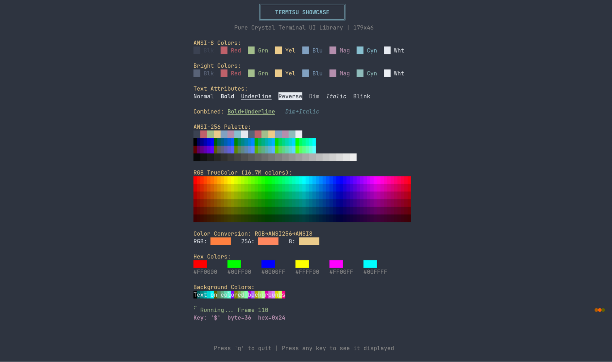

[](https://crystal-lang.org/)
[](LICENSE)

[](https://github.com/omarluq/termisu/actions/workflows/test.yml)
[](https://github.com/omarluq/termisu/actions/workflows/format.yml)
[](https://github.com/omarluq/termisu/actions/workflows/ameba.yml)
[](https://github.com/omarluq/termisu/actions/workflows/pages.yml)

# Termisu


Termisu is a library that provides a minimalistic API for writing text-based user interfaces in pure Crystal. It offers an abstraction layer over terminal capabilities through cell-based rendering with double buffering, allowing efficient and flicker-free TUI development. The API is intentionally small and focused, making it easy to learn, test, and maintain. Inspired by termbox, Termisu brings similar simplicity and elegance to the Crystal ecosystem.

> [!WARNING]
> Termisu is still in development and is considered unstable. The API is subject to change, and you may encounter bugs or incomplete features.
> Use it at your own risk, and contribute by reporting issues or suggesting improvements!

## Installation

1. Add the dependency to your `shard.yml`:

```yaml
dependencies:
  termisu:
    github: omarluq/termisu
```

2. Run `shards install`

## Usage

```crystal
require "termisu"

termisu = Termisu.new

begin
  # Set cells with colors and attributes
  termisu.set_cell(0, 0, 'H', fg: Termisu::Color.red, attr: Termisu::Attribute::Bold)
  termisu.set_cell(1, 0, 'i', fg: Termisu::Color.green)
  termisu.set_cursor(2, 0)
  termisu.render

  # Event loop with keyboard and mouse support
  termisu.enable_mouse
  loop do
    if event = termisu.poll_event(100)
      case event
      when Termisu::Events::Key
        break if event.key.escape?
        break if event.key.lower_q?
      when Termisu::Events::Mouse
        termisu.set_cell(event.x, event.y, '*', fg: Termisu::Color.cyan)
        termisu.render
      end
    end
  end
ensure
  termisu.close
end
```

See `examples/showcase.cr` and `examples/keyboard_and_mouse.cr` for complete demonstrations.



## Roadmap

**Current Status: Alpha (v0.1.0)**

| Component | Status |
|-----------|--------|
| Terminal I/O | ✅ Complete |
| Terminfo | ✅ Complete |
| Double Buffering | ✅ Complete |
| Colors | ✅ Complete |
| Attributes | ✅ Complete |
| Keyboard Input | ✅ Complete |
| Mouse Input | ✅ Complete |
| Event System | ✅ Complete |
| Async Channels | 🔄 Planned (v0.2) |
| Resize Events | 🔄 Planned (v0.2) |
| Unicode/Wide Chars | 🔄 Planned (v0.2) |

### Completed

- **Terminal I/O** - Raw mode, alternate screen, EINTR handling
- **Terminfo** - Binary parser (16/32-bit), 414 capabilities, builtin fallbacks
- **Double Buffering** - Diff-based rendering, cell batching, state caching
- **Colors** - ANSI-8, ANSI-256, RGB/TrueColor with conversions
- **Attributes** - Bold, underline, blink, reverse, dim, italic, hidden
- **Keyboard Input** - 170+ keys, F1-F24, modifiers (Ctrl/Alt/Shift/Meta)
- **Mouse Input** - SGR (mode 1006), normal (mode 1000), motion events
- **Event System** - Unified Key/Mouse events, Kitty protocol, modifyOtherKeys
- **Performance** - RenderState optimization, escape sequence batching
- **Terminfo tparm** - Full processor with conditionals, stack, variables
- **Logging** - Structured async/sync dispatch, zero hot-path overhead

### Planned (v0.2.0) - Async Architecture

- **Async event channels** - Crystal fiber/channel-based event system
- **SIGWINCH resize events** - Channel-based resize notification
- **Unicode/wide character support** - CJK, emoji (wcwidth)
- **Synchronized updates** - DEC mode 2026 (prevents screen tearing)

### Future (v0.3.0+)

- Async input reader fiber
- Timer/tick channels for animations
- Fan-in event multiplexer
- Strikethrough attribute

## Inspiration

Termisu is inspired by and follows the design philosophy of:

- [nsf/termbox](https://github.com/nsf/termbox) - The original termbox library
- [nsf/termbox-go](https://github.com/nsf/termbox-go) - Go implementation of termbox

## Contributing

See [CONTRIBUTING.md](CONTRIBUTING.md) for detailed guidelines.

1. Fork it (<https://github.com/omarluq/termisu/fork>)
2. Create your feature branch (`git checkout -b my-new-feature`)
3. Commit your changes (`git commit -am 'Add some feature'`)
4. Push to the branch (`git push origin my-new-feature`)
5. Create a new Pull Request

## Contributors

- [omarluq](https://github.com/omarluq) - creator and maintainer

## License

The gem is available as open source under the terms of the [MIT License](LICENSE.txt).

## Code of conduct

Everyone interacting in this project’s codebases, issue trackers, chat rooms and mailing lists is expected to follow the [code of conduct](CODE_OF_CONDUCT.md).
