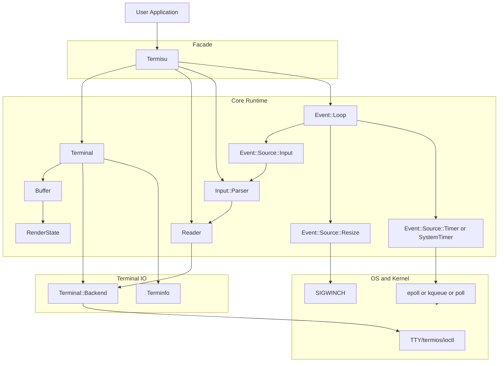
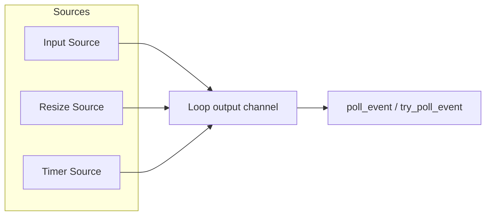
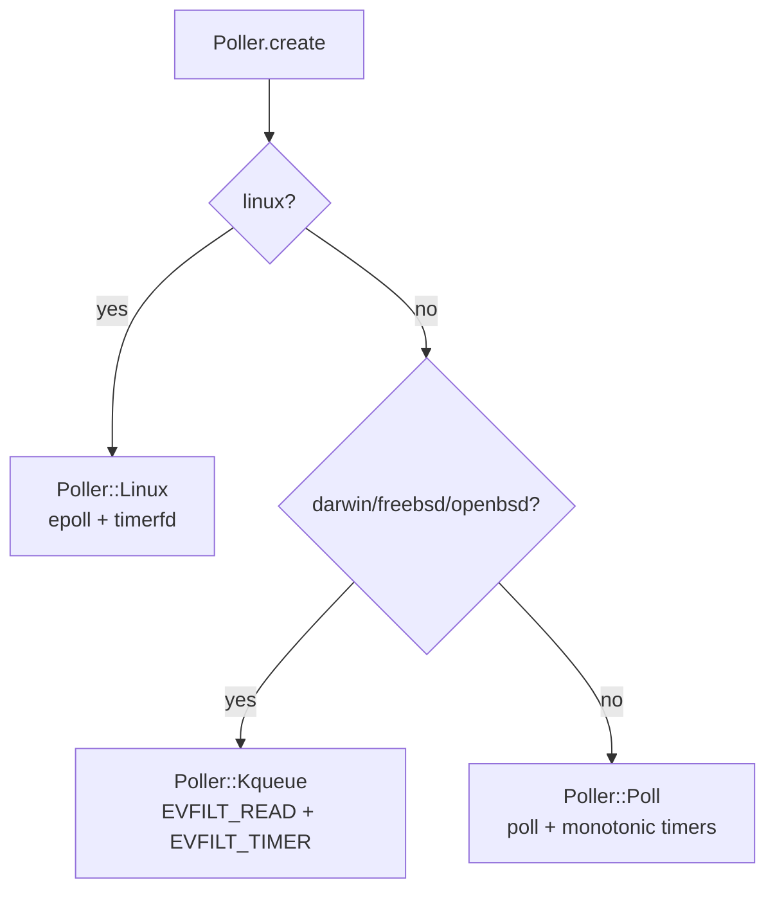
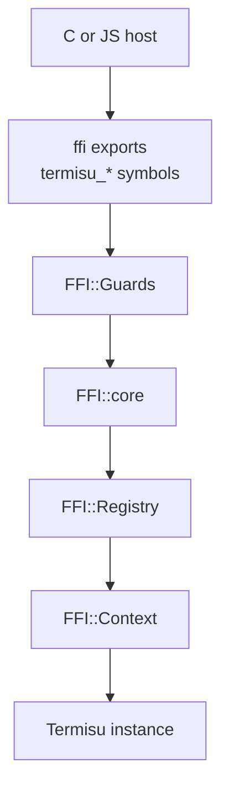

# Termisu Architecture

Last verified: 2026-02-28

This document describes the current implementation architecture for Termisu (Crystal core + optional C FFI boundary).

## System Context



## Lifecycle Sequence

```mermaid
sequenceDiagram
  participant App
  participant Termisu
  participant Terminal
  participant Loop as Event::Loop

  App->>Termisu: new(sync_updates: true)
  Termisu->>Terminal: initialize backend/terminfo/buffer
  Termisu->>Terminal: enable_raw_mode
  Termisu->>Loop: add input + resize sources
  Termisu->>Loop: start
  Termisu->>Terminal: enter_alternate_screen
  Termisu-->>App: ready

  App->>Termisu: close
  Termisu->>Loop: stop all sources + close channel
  Termisu->>Terminal: exit_alternate_screen
  Termisu->>Terminal: disable_raw_mode
  Termisu->>Terminal: close backend
  Termisu-->>App: closed
```

## Rendering Pipeline

```mermaid
flowchart TD
  A[set_cell or clear] --> B[Buffer.back updated]
  B --> C[Dirty row tracking]
  C --> D[Termisu.render]
  D --> E{sync_updates enabled?}
  E -- yes --> F[Emit BSU (Begin Synchronized Update)]
  E -- no --> G[Skip BSU (Begin Synchronized Update)]
  F --> H[Buffer.render_to diff front vs back]
  G --> H
  H --> I[Row batch rendering]
  I --> J[RenderState apply style/cursor deltas]
  J --> K[Terminal writes escape sequences + graphemes]
  K --> L[Render cursor visibility/position]
  L --> M{sync_updates enabled?}
  M -- yes --> N[Emit ESU (End Synchronized Update) + flush]
  M -- no --> O[Flush]
  N --> P[front buffer synchronized]
  O --> P
```

Notes:
- Buffer enforces wide-cell occupancy invariants and skips continuation cells during rendering.
- Cursor tracking is width-aware (`columns_advanced`) so wide graphemes stay aligned.

## Event Pipeline



Source specifics:
- Input source drains parser events in bounded bursts (`MAX_DRAIN_PER_CYCLE`) to preserve fairness.
- Resize source combines SIGWINCH with periodic polling.
- Timer source options:
  - `Timer`: sleep-based, non-blocking send with backpressure accounting.
  - `SystemTimer`: poller-based kernel timer, expirations folded into `missed_ticks`.

## Platform Backend Selection



Other platform branches:
- `TTY` uses a FreeBSD/OpenBSD-specific open mode branch.
- terminal size ioctl constants are platform-specific in `Terminal::Backend`.

## Optional C FFI Boundary



Safety model:
- `FFI::Runtime.ensure_initialized` bootstraps shared-library runtime.
- exceptions are translated into status codes + thread-local error text.
- ABI compatibility is checked via `termisu_abi_version` and `termisu_layout_signature`.

## Key Invariants

- Terminal semantics live in Crystal core; wrappers should not reimplement them.
- Buffer front/back state is the source of render diff truth.
- Continuation cells are storage-only; never rendered directly.
- Event loop start/stop is idempotent and source-driven.
- FFI callers must treat non-`OK` statuses as authoritative and read last error text when needed.

## Source Anchors

- [src/termisu.cr](../src/termisu.cr)
- [src/termisu/terminal.cr](../src/termisu/terminal.cr)
- [src/termisu/buffer.cr](../src/termisu/buffer.cr)
- [src/termisu/render_state.cr](../src/termisu/render_state.cr)
- [src/termisu/event/loop.cr](../src/termisu/event/loop.cr)
- [src/termisu/event/source/input.cr](../src/termisu/event/source/input.cr)
- [src/termisu/event/source/resize.cr](../src/termisu/event/source/resize.cr)
- [src/termisu/event/source/timer.cr](../src/termisu/event/source/timer.cr)
- [src/termisu/event/source/system_timer.cr](../src/termisu/event/source/system_timer.cr)
- [src/termisu/event/poller.cr](../src/termisu/event/poller.cr)
- [src/termisu/ffi/exports.cr](../src/termisu/ffi/exports.cr)
- [src/termisu/ffi/core.cr](../src/termisu/ffi/core.cr)
- [src/termisu/ffi/runtime.cr](../src/termisu/ffi/runtime.cr)
- [src/termisu/ffi/layout.cr](../src/termisu/ffi/layout.cr)
- [include/termisu/ffi.h](../include/termisu/ffi.h)
