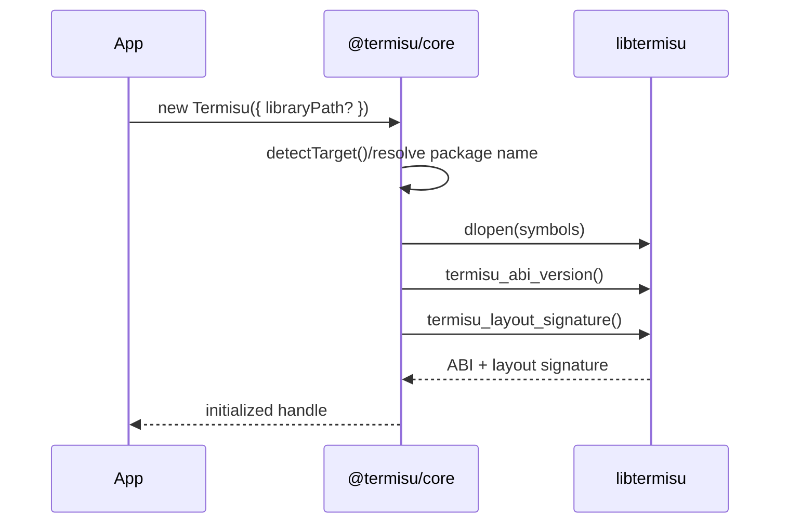
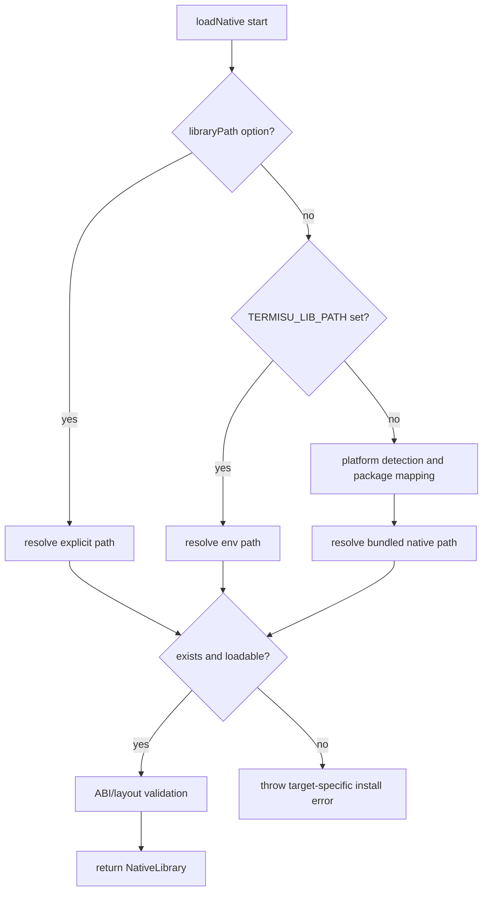

# Termisu JS Runtime and FFI Architecture

Last verified: 2026-02-28

This document captures the current minimal package architecture for JS bindings
and how it maps to the Crystal core and native artifacts.

## Goals

- Keep rendering, input parsing, Unicode width, and terminal-mode semantics in Crystal.
- Keep the JS surface centered on `@termisu/core`.
- Make platform-specific native delivery possible without exposing multiple
  public JS entrypoints.
- Keep behavior consistent across Linux, macOS, and BSD targets.
- Isolate platform differences to native artifact loading and capability reporting.

## Non-Goals

- Reimplementing core terminal semantics in TypeScript.
- Framework-specific adapters and starter templates.

## Ground Truth From Crystal

Platform behavior is compile-time selected in Crystal and already abstracted behind stable APIs.

- `Poller.create` selects `Linux`, `Kqueue`, or `Poll` backend.
- Linux uses `epoll + timerfd`.
- Darwin/FreeBSD/OpenBSD uses `kqueue` timers.
- Fallback `poll` path handles ABI-specific `nfds_t` differences.
- TTY and terminal-size ioctl handling have platform branches.
- FFI exports include ABI version and layout signature checks.

These differences belong in native code, not in JS behavior logic.

## Package Topology

```mermaid
flowchart TD
  subgraph App
    APP[User app]
  end

  subgraph JS
    CORE[@termisu/core]
  end

  subgraph NativePkgs
    N1[@termisu/native-linux-x64-gnu]
    N2[@termisu/native-linux-arm64-gnu]
    N3[@termisu/native-linux-x64-musl]
    N4[@termisu/native-linux-arm64-musl]
    N5[@termisu/native-darwin-x64]
    N6[@termisu/native-darwin-arm64]
    N7[@termisu/native-freebsd-x64]
    N8[@termisu/native-freebsd-arm64]
  end

  subgraph NativeLib
    SO[libtermisu.so or libtermisu.dylib]
  end

  APP --> CORE
  CORE --> SO

  CORE -. resolves target package .-> N1
  CORE -. resolves target package .-> N2
  CORE -. resolves target package .-> N3
  CORE -. resolves target package .-> N4
  CORE -. resolves target package .-> N5
  CORE -. resolves target package .-> N6
  CORE -. resolves target package .-> N7
  CORE -. resolves target package .-> N8
```

## Native Load Contract



## Library Path Resolution

Resolution precedence should be deterministic:

1. explicit `libraryPath` option
2. `TERMISU_LIB_PATH`
3. platform resolver mapping (`os/arch/libc` -> native package)
4. actionable error with target and checked paths



## Responsibility Matrix

| Package | Owns | Must not own |
| --- | --- | --- |
| `@termisu/core` | target detection, native package mapping, path resolution, FFI symbol binding, ABI/layout validation, native call wrappers | framework policy |
| `@termisu/native-*` | platform-specific package metadata and artifact delivery | runtime behavior semantics |

## Capability Model

Runtime should consume one capability snapshot at startup.

Suggested fields:
- `platform` (`linux`, `darwin`, `freebsd`, ...)
- `poller_backend` (`linux`, `kqueue`, `poll`)
- `feature_bits` (mouse, enhanced keyboard, system timer, etc.)

Behavior contract:
- unsupported capabilities are exposed as `off` flags
- API semantics do not drift by platform

## Current Implementation Notes

- `@termisu/core` already validates ABI and struct layout signature.
- `@termisu/core` currently resolves explicit paths, `TERMISU_LIB_PATH`,
  platform-package candidates, and repository-local `bin/` candidates.
- native packages currently expose manifest metadata and still need artifact
  payload and release wiring before they can be auto-loaded end to end.

## Source Anchors

- [src/termisu/event/poller.cr](../src/termisu/event/poller.cr)
- [src/termisu/event/poller/linux.cr](../src/termisu/event/poller/linux.cr)
- [src/termisu/event/poller/kqueue.cr](../src/termisu/event/poller/kqueue.cr)
- [src/termisu/event/poller/poll.cr](../src/termisu/event/poller/poll.cr)
- [src/termisu/tty.cr](../src/termisu/tty.cr)
- [src/termisu/terminal/backend.cr](../src/termisu/terminal/backend.cr)
- [src/termisu/ffi/exports.cr](../src/termisu/ffi/exports.cr)
- [src/termisu/ffi/layout.cr](../src/termisu/ffi/layout.cr)
- [javascript/core/src/native.ts](../javascript/core/src/native.ts)
- [javascript/core/src/termisu.ts](../javascript/core/src/termisu.ts)
- [javascript/core/src/platform.ts](../javascript/core/src/platform.ts)
